# FraudLens — AML Detection & Investigation System

FraudLens is a real-time Anti-Money Laundering (AML) system that combines machine learning, graph analysis, and human-in-the-loop verification to detect and investigate suspicious financial transactions.

---

## System Overview

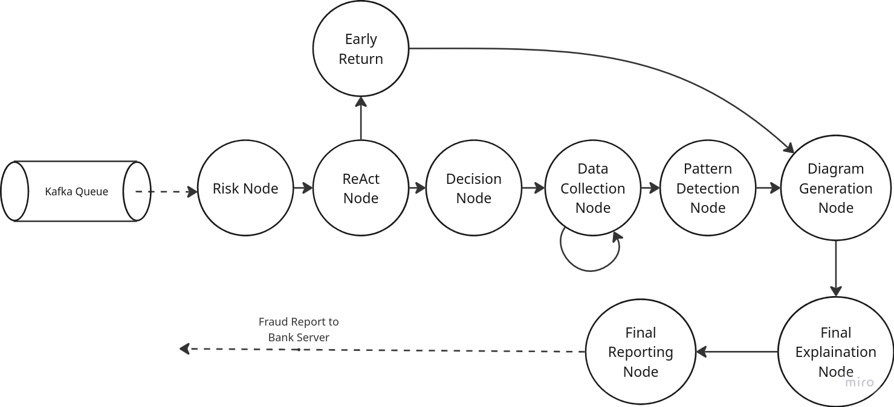

FraudLens processes transactions in real time using a pipeline of streaming, machine learning, graph analysis, and human validation.

---

## UI Overview

### Dashboard

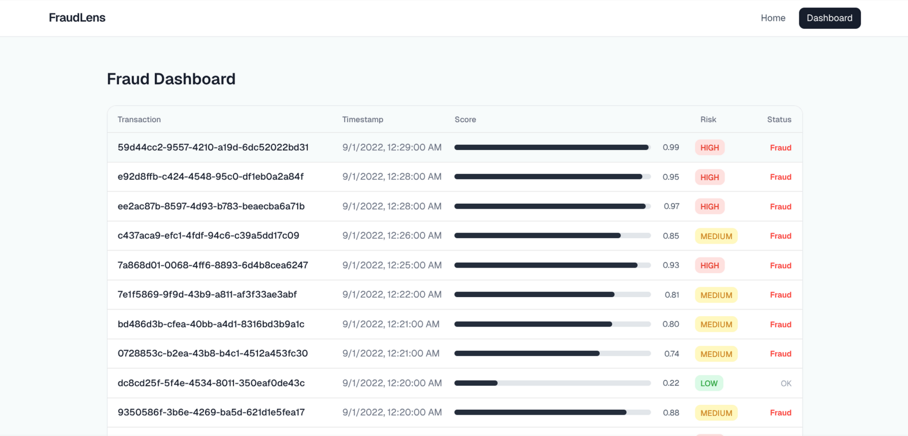

Real-time transaction monitoring with a structured, table-like layout and risk indicators.

---

### Transaction Inspection

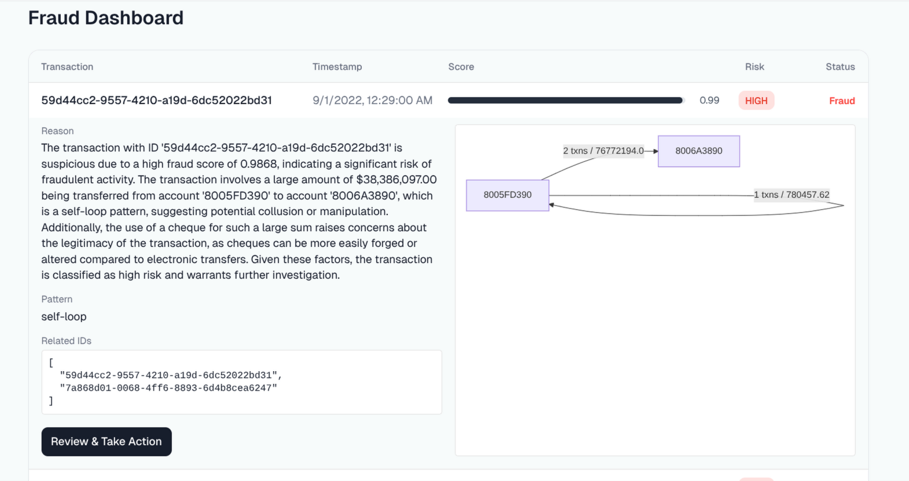

Expandable rows provide detailed insights including reasoning, detected patterns, and related transaction data.

---

### Human Intervention

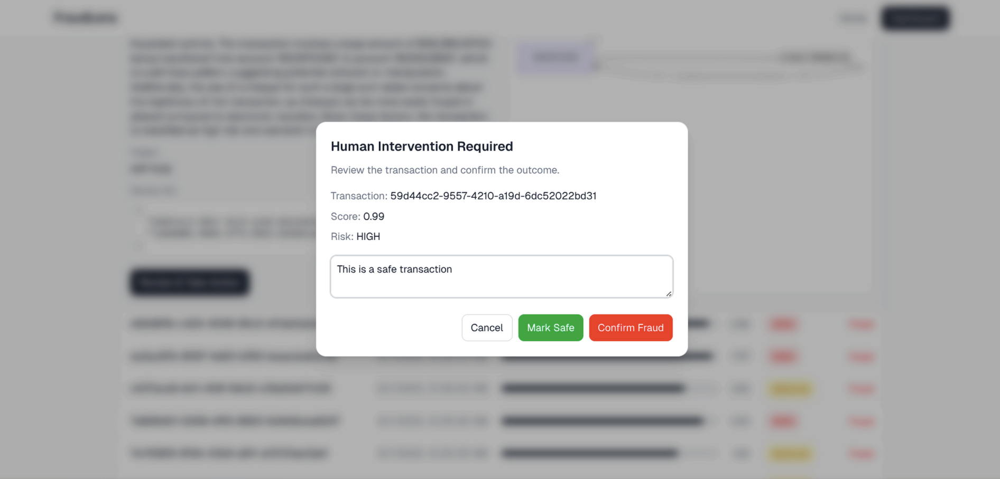

Analysts can review flagged transactions and take action by confirming fraud or marking as safe.

---

### Landing Page

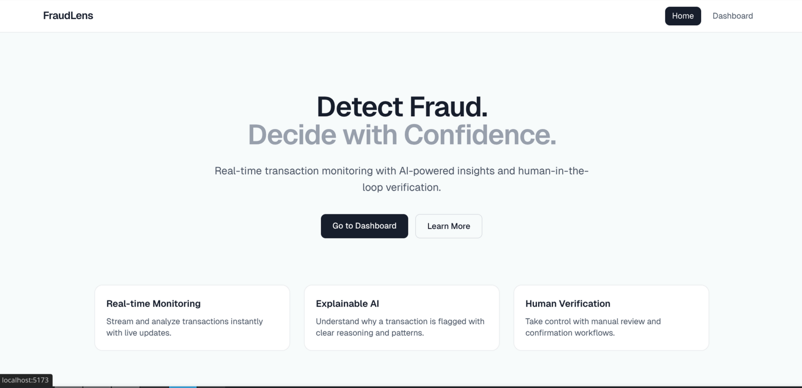

Minimal entry point with clear navigation into the system.

---

## Graph & Pattern Insights

FraudLens uses graph-based reasoning to detect suspicious transaction behavior.

### Fan-in Pattern

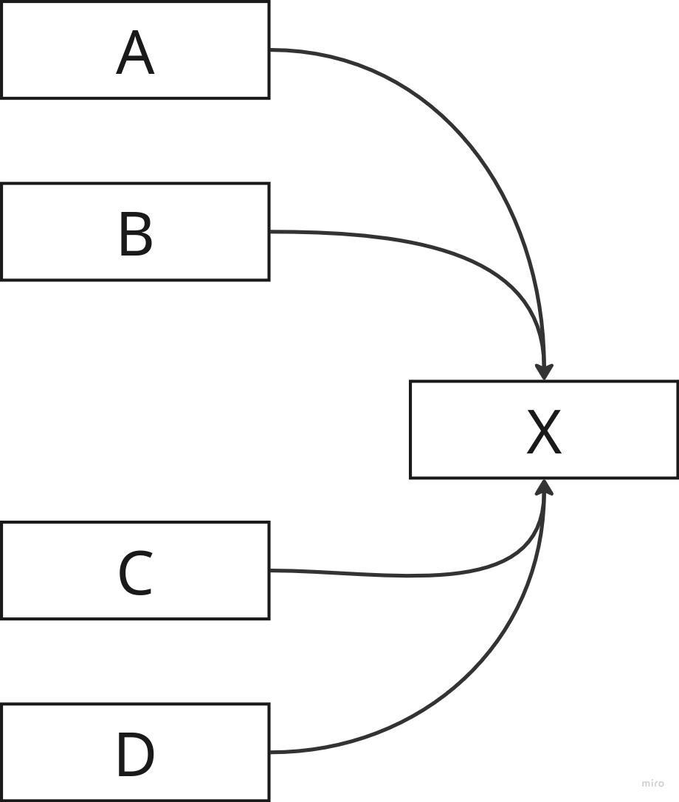

Multiple accounts sending funds into a single account.

---

### Fan-out Pattern

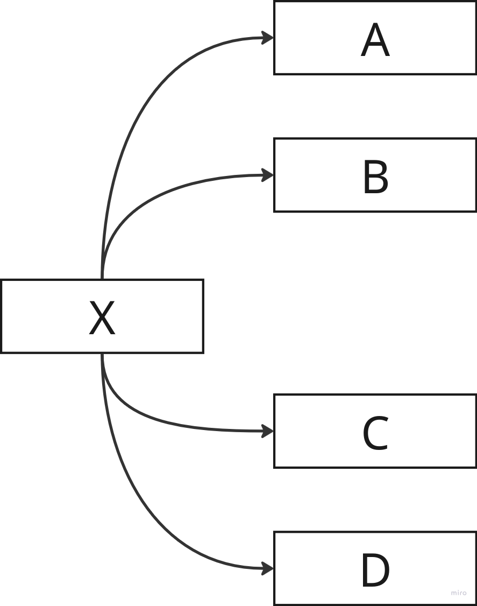

One account distributing funds across multiple accounts.

---

### Burst Transactions

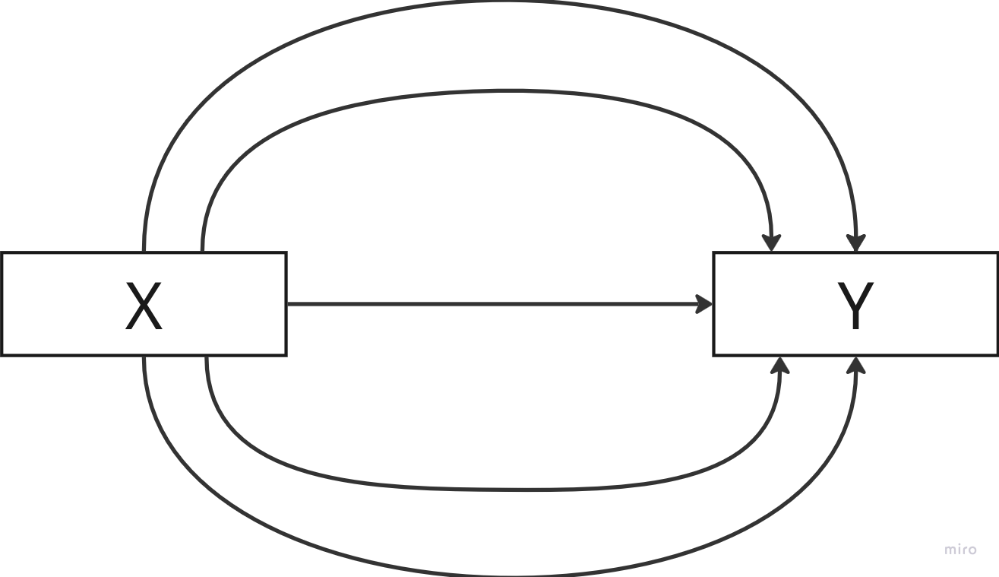

High-frequency transactions in a short time window.

---

### Cyclic Transfers

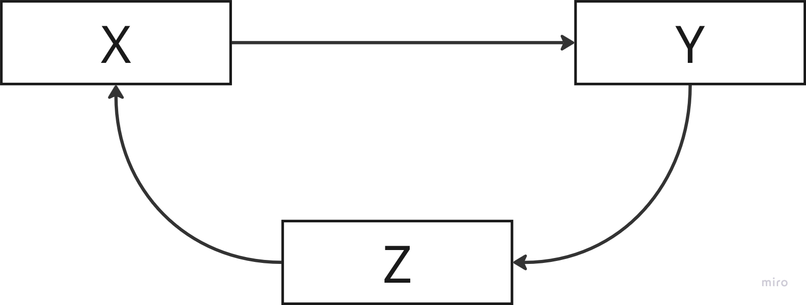

Circular movement of funds across accounts.

---

### Gather-Scatter Pattern

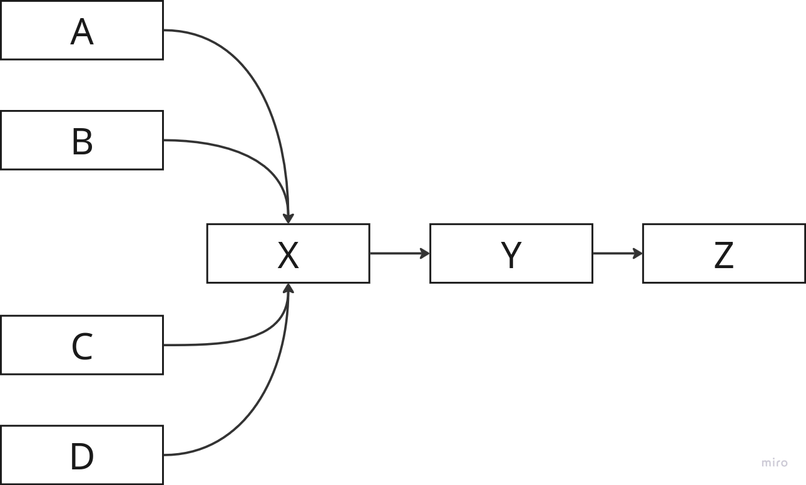

Funds are aggregated and then redistributed.

---

### Self Loop

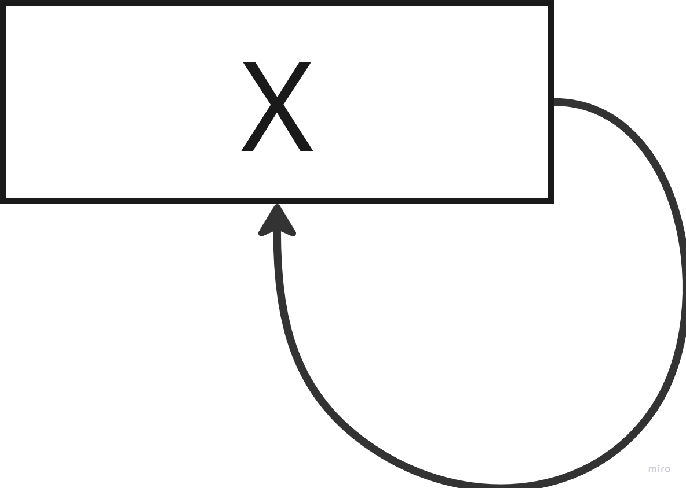

Transactions looping back to the same account.

---

### Layering

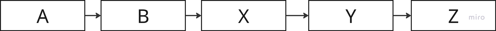

Complex multi-hop transfers to obscure origin.

---

## Features

- Real-time transaction streaming via Kafka  
- ML-based fraud detection using XGBoost  
- Explainable insights powered by LLMs  
- Graph-based relationship analysis  
- Interactive dashboard built with React and TailwindCSS  
- Human-in-the-loop verification workflow  
- Live updates using Server-Sent Events (SSE)  

---

## Architecture Flow

```
Bank Simulation → Kafka → AML Backend → ML + LLM + Graph → Database → Dashboard (SSE)
```

---

## Core Workflow

1. Transactions are generated by the simulation service  
2. Events are streamed via Kafka  
3. AML backend processes each transaction:
   - ML-based fraud prediction  
   - Graph-based relationship analysis  
   - LLM-generated reasoning  
4. Results are stored in the database  
5. Data is streamed to the dashboard via SSE  
6. Analysts review and confirm final decisions  

---

## Tech Stack

**Backend**
- FastAPI  
- Kafka  
- PostgreSQL  
- LangGraph  
- XGBoost  
- LLM integration  

**Frontend**
- React + TypeScript  
- TailwindCSS  
- Mermaid.js  

---

## Future Improvements

- Role-based access control (Analyst / Admin)  
- Audit logs and decision history  
- Advanced explainability dashboards  
- Alerting system (email/webhooks)  
- Dark mode  